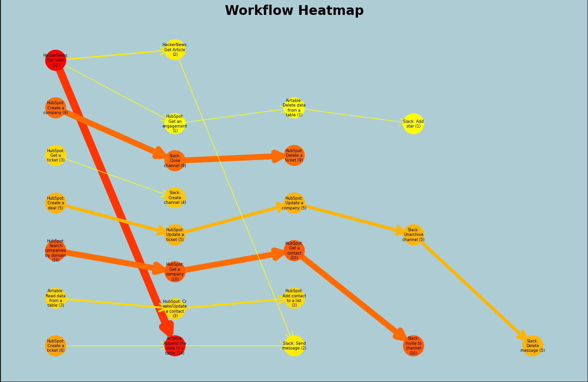

# 🍋 Lemon AI Python Client

## About

**The analytics notebook to build powerful copilots in minutes and execute highly efficient workflow automations by accessing internal tools like Airtable, Hubspot, Slack or Github. With Lemon AI, it is possible to seamlessly grant access to a wide range of APIs for read and write operations, creating copilots in minutes and unlocking the true potential of LLMs.**

## 📈 Getting Started

The included Jupyter Notebook allows you to visualize how your LLM agents are using tools to solve a given task. To get started just copy the lemonai.log file to this project and run the notebook. As a result, you will be able to understand how frequently and in which workflow combination your tools are used:

